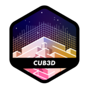

<h1 align="center">
My projects at 42 Paris - 
</h1>

## Common Core

<!-- | Project | Description | Score |
|:-------:|:-----------:|:-----:|
| <a href="https://github.com/Baarrbb/42-libft"> [Libft](https://github.com/Baarrbb/42-libft) | Coding a C library. |  21.11.23 |
|  [get_next_line](https://github.com/Baarrbb/42-get_next_line) | Function that returns a line read from a file descriptor. |  01.12.23 |
|  [ft_printf](https://github.com/Baarrbb/42-ft_printf) | Recode printf() |  06.12.23 |
|  [push_swap](https://github.com/Baarrbb/42-push_swap) | Sort data on a stack, with a limited set of instructions, using the lowest possible number of actions. |  02.02.24 |
|  [so_long](https://github.com/Baarrbb/42-so_long) | Create a basic 2D game. |  08.02.24 |
|  [minitalk](https://github.com/Baarrbb/42-minitalk) | Small data exchange program using UNIX signals. |  26.02.24 |
|  [Philosophers](https://github.com/Baarrbb/42-Philosophers) | Basics of threading a process. |  07.05.24 |
|  [minishell](https://github.com/Baarrbb/42-minishell) | Create a simple shell. |  29.05.24 |
|  [cub3d](https://github.com/Baarrbb/42-cub3d) | This project is inspired by the world-famous Wolfstein 3D game. Make a dynamic view inside a maze. |  06.09.24 | -->

<!--  -->

<table>
	<tr>
		<th style="text-align: center;">Project</th>
		<th style="text-align: center;">Description</th>
		<th style="text-align: center;">Score</th>
	</tr>
	<tr>
		<th colspan="3" style="text-align: center; background-color: #e0e0e0;">Circle 1</th>
	</tr>
	<tr>
		<td style="vertical-align: middle; text-align: center;">
			
		</td>
		<td style="vertical-align: middle; text-align: center;">
			Coding a C library.
		</td>
		<td style="vertical-align: middle; text-align: center;">
			
			 
			
		</td>
	</tr>
	<tr>
		<th colspan="3" style="text-align: center; background-color: #e0e0e0;">Circle 2</th>
	</tr>
	<tr>
		<td>
			
		</td>
		<td>Function that returns a line read from a file descriptor.</td>
		<td>
			
			 
			
		</td>
	</tr>
	<tr>
		<td>
			
		</td>
		<td>Recode printf()</td>
		<td>
			
			 
			
		</td>
	</tr>
	<tr>
		<th colspan="3" style="text-align: center; background-color: #e0e0e0;">Circle 3</th>
	</tr>
	<tr>
		<td>
			
		</td>
		<td>Sort data on a stack, with a limited set of instructions, using the lowest possible number of actions.</td>
		<td>
			
			 
			
		</td>
	</tr>
	<tr>
		<td>
			
		</td>
		<td>Create a basic 2D game.</td>
		<td>
			
			 
			
		</td>
	</tr>
	<tr>
		<td>
			
		</td>
		<td>Small data exchange program using UNIX signals.</td>
		<td>
			
			 
			
		</td>
	</tr>
	<tr>
		<th colspan="3" style="text-align: center; background-color: #e0e0e0;">Circle 4</th>
	</tr>
	<tr>
		<td>
			
		</td>
		<td>Basics of threading a process.</td>
		<td>
			
			 
			
		</td>
	</tr>
	<tr>
		<td>
			
		</td>
		<td>Create a simple shell.</td>
		<td>
			
			 
			
		</td>
	</tr>
	<tr>
		<th colspan="3" style="text-align: center; background-color: #e0e0e0;">Circle 5</th>
	</tr>
	<tr>
		<td>
			
		</td>
		<td>This project is inspired by the world-famous Wolfstein 3D game. Make a dynamic view inside a maze.</td>
		<td>
			
			 
			
		</td>
	</tr>
	<tr>
		<td></td>
		<td></td>
		<td> </td>
	</tr>

</table>

<!--   -->

<!-- | Project | Description | Score |
|:-------:|:-----------:|:-----:|
|  | Coding a C library. |   |
|  | Function that returns a line read from a file descriptor. |  |
| [ft_printf](https://github.com/Baarrbb/42-ft_printf) | Recode printf() |   |

| [push_swap](https://github.com/Baarrbb/42-push_swap) | Sort data on a stack, with a limited set of instructions, using the lowest possible number of actions. |   |
| [so_long](https://github.com/Baarrbb/42-so_long) | Create a basic 2D game. |   |
| [minitalk](https://github.com/Baarrbb/42-minitalk) | Small data exchange program using UNIX signals. |   |

|[Philosophers](https://github.com/Baarrbb/42-Philosophers) | Basics of threading a process. |   |
| [minishell](https://github.com/Baarrbb/42-minishell) | Create a simple shell. |   |
| [cub3d](https://github.com/Baarrbb/42-cub3d) | This project is inspired by the world-famous Wolfstein 3D game. Make a dynamic view inside a maze. |  | -->

## [Piscine](https://github.com/Baarrbb/42-piscine)

 
 

#

